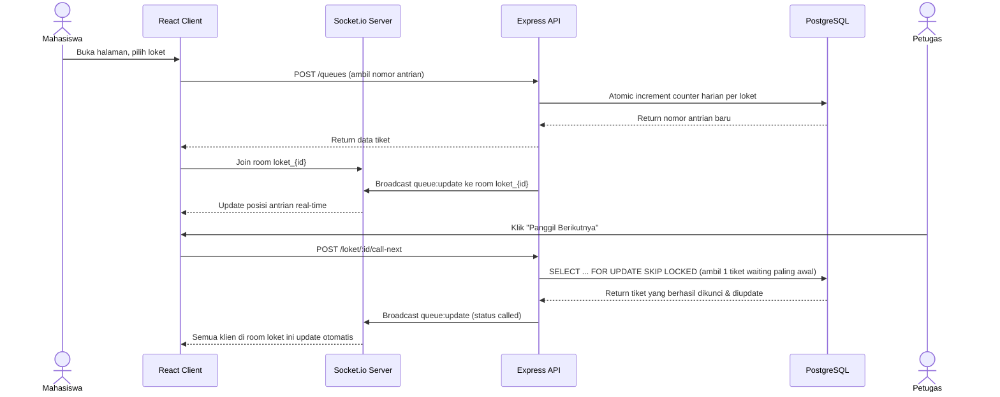

# PRD — Antrian Digital

## 1. Overview
**Antrian Digital** adalah sistem antrian real-time berbasis web untuk layanan loket kampus (administrasi prodi, TU, klinik kampus, dll). Mahasiswa mengambil nomor antrian dari HP tanpa perlu install aplikasi terpisah, melihat posisi antrian mereka **update otomatis secara real-time** tanpa refresh manual, dan mendapat estimasi waktu tunggu. Petugas loket punya dashboard untuk memanggil nomor berikutnya dan memantau statistik antrian harian.

**Masalah yang diselesaikan:**
Layanan loket kampus saat ini masih mengandalkan antrian fisik (berdiri/duduk menunggu di tempat) tanpa kepastian posisi antrian atau estimasi waktu tunggu — mahasiswa tidak bisa memperkirakan kapan gilirannya, rawan terjadi serobot antrian, dan tidak ada data historis soal berapa lama rata-rata 1 layanan diproses.

**Tujuan Utama Proyek:**
1. Menyelesaikan masalah antrian fisik kampus secara fungsional.
2. Menjadi bahan pembelajaran teknis: sistem **real-time** (WebSocket) dan **concurrency handling** di database relational — dua hal yang belum pernah diterapkan di project-project sebelumnya (Vendura, StikIn, MyLamaran).

## 2. Requirements
- Mahasiswa dapat mengambil nomor antrian untuk loket tertentu tanpa login/akun (guest, cukup nomor antrian sebagai identitas sesi).
- Posisi antrian & status ter-update **real-time** di layar semua orang yang sedang menunggu, tanpa refresh manual (via WebSocket, bukan polling).
- **Setiap nomor antrian yang diambil harus unik dan berurutan per loket per hari** — tidak boleh ada 2 orang mendapat nomor yang sama meskipun mengambil di waktu yang nyaris bersamaan.
- **Pemanggilan nomor berikutnya oleh petugas harus aman dari race condition** — jika 2 petugas di loket yang sama menekan "Panggil Berikutnya" secara bersamaan, sistem harus menjamin mereka mendapat 2 nomor antrian yang berbeda, bukan nomor yang sama.
- Dashboard petugas: panggil nomor berikutnya, tandai selesai, tandai skip (tidak hadir saat dipanggil).
- Estimasi waktu tunggu untuk mahasiswa yang sedang menunggu, dihitung dari rata-rata waktu layanan sebelumnya di loket yang sama.
- Mendukung multi-loket (beberapa layanan berjalan independen, masing-masing punya antrian sendiri).
- Halaman publik menampilkan status semua loket sekaligus (opsional, nice-to-have) — misal papan status seperti di rumah sakit/bank.

## 3. Core Features (MVP)
- **Ambil Nomor Antrian** — pilih loket, dapat nomor antrian unik hari itu.
- **Live Queue Position** — halaman yang menampilkan posisi antrian pengguna, update otomatis via WebSocket saat ada perubahan (nomor lain dipanggil/selesai).
- **Dashboard Petugas** — login sederhana, lihat antrian yang sedang menunggu, tombol "Panggil Berikutnya", "Selesai", "Skip".
- **Estimasi Waktu Tunggu** — dihitung dari rata-rata durasi layanan (called_at → completed_at) beberapa antrian terakhir di loket yang sama, dikalikan posisi antrian pengguna.
- **Manajemen Loket** — CRUD loket (nama, deskripsi, aktif/nonaktif) oleh admin.

## 4. Nice-to-Have (Setelah MVP Stabil)
- Papan status semua loket dalam 1 halaman (mirip display TV di ruang tunggu).
- Notifikasi suara/getar saat nomor pengguna hampir dipanggil (misal saat tersisa 2 antrian lagi).
- Statistik harian/mingguan (grafik jumlah antrian, rata-rata waktu tunggu per loket).

## 5. User Flow

**a. Alur Mahasiswa:**
1. Buka halaman Antrian Digital, pilih loket yang dituju.
2. Klik "Ambil Nomor Antrian", mendapat nomor unik (misal `A-014`).
3. Diarahkan ke halaman status: melihat nomor yang sedang dipanggil, posisi antrian sendiri, estimasi waktu tunggu — semua ter-update otomatis tanpa refresh, karena terhubung lewat WebSocket.
4. Saat nomornya dipanggil, tampilan berubah jelas (highlight/animasi) menandakan giliran sudah tiba.

**b. Alur Petugas Loket:**
1. Login ke dashboard petugas.
2. Melihat daftar antrian yang sedang menunggu untuk loket yang dikelola.
3. Klik "Panggil Berikutnya" — sistem otomatis ambil nomor antrian paling awal yang masih `waiting`, ubah statusnya jadi `called`, dan broadcast update ke semua klien yang terhubung ke loket itu.
4. Setelah selesai melayani, klik "Selesai" (atau "Skip" jika mahasiswa tidak hadir saat dipanggil).

## 6. Kebutuhan Non-Fungsional (Fokus Concurrency & Real-Time)

| Requirement | Detail |
|---|---|
| **Atomic Ticket Numbering** | Pengambilan nomor antrian baru harus atomic — 2 permintaan bersamaan tidak boleh menghasilkan nomor yang sama |
| **Atomic Call-Next** | Pemanggilan nomor berikutnya oleh petugas harus atomic — 2 petugas di loket sama tidak boleh memanggil nomor antrian yang sama |
| **Real-Time Broadcast** | Setiap perubahan status antrian (baru diambil/dipanggil/selesai/skip) harus langsung ter-broadcast ke semua klien yang sedang menunggu di loket terkait, tanpa perlu refresh/polling manual |
| **Konsistensi Nomor Harian** | Penomoran antrian reset setiap hari, per loket (loket A dan loket B punya nomor urut masing-masing dimulai dari 1 setiap hari) |

## 7. Arsitektur Sistem



## 8. Skema Data

```sql
loket (
    id, name, description, is_active,
    created_at, updated_at
)

daily_counters (
    id, loket_id, date, last_number,
    UNIQUE(loket_id, date)
)

queue_tickets (
    id, loket_id, number, status,   -- status: waiting | called | done | skipped
    created_at, called_at, completed_at
)

admins (
    id, username, password_hash, loket_id,
    created_at
)
```

## 9. Tech Stack (PERN)
- **Database:** PostgreSQL — dipilih (bukan NoSQL) karena struktur data relational, kebutuhan agregasi statistik (rata-rata waktu tunggu), dan dukungan native untuk pola concurrency `SELECT ... FOR UPDATE SKIP LOCKED`.
- **Backend:** Express.js (Node.js) — REST API untuk CRUD & aksi antrian.
- **Real-Time:** Socket.io — broadcast update posisi antrian ke klien secara real-time, menggunakan konsep "room" per loket.
- **Frontend:** React (via Vite) — SPA terpisah dari backend (bukan server-rendered), berkomunikasi ke Express API + Socket.io client.
- **Database Layer:** `node-postgres` (`pg`) langsung — tanpa ORM berat, karena skema sederhana (4 tabel) dan dibutuhkan kontrol penuh atas raw SQL untuk pola `FOR UPDATE SKIP LOCKED` yang tidak semua ORM dukung secara native.
- **Auth Admin:** JWT sederhana — hanya untuk dashboard petugas, halaman publik (ambil nomor, lihat status) tidak butuh autentikasi sama sekali.
- **Deployment:** VPS (konsisten dengan project-project sebelumnya).